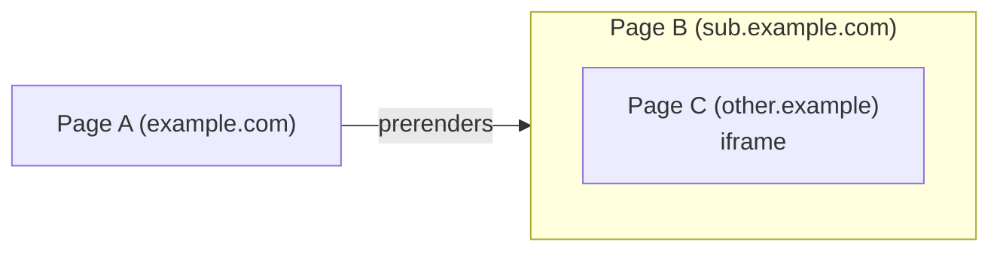

# Prerendering cross-origin iframes

By default, navigational prerendering delays the loading of all cross-origin iframes until the referring page activates the prerendered page. (I.e., it becomes viewable by the user in a top-level tab.)

We believe this is a good default. Cross-origin iframes commonly contain third-party code, e.g. analytics or ad impression counting, which is not adapted to be run in a prerendering context. Or, they contain less-important content, which it is best to delay for efficiency's sake so that if the user _doesn't_ activate the prerendered page, less waste occurs.

However, there are some cases where cross-origin iframes are particularly important to an application, such that delaying them negates many of the benefits of prerendering. Some sites use a "shell" architecture where the outer page is hosted on one origin, but a subdomain or third party provides most of the user-facing application. Examples include demo-hosting sites like [JS Bin](https://jsbin.com/), applications like Google Chat and Office 365, payment processing pages during a checkout flow, or pages where embedded content (videos, maps, chat widgets, etc.) are front-and-center.

We propose adding an opt-in for such pages, via a HTTP header

```http
Supports-Loading-Mode: prerender-cross-origin-frames
```

which requests that the browser prerender cross-origin frames on pages containing the header. (The browser remains free to ignore this request, or to ignore the overall request to prerender, if it believes that would be better for user experience.)

## Detailed design

### Who sends the header

It is important to be clear on which page supplies the header. In a setup like the following:



we require that page B has the `Supports-Loading-Mode: prerender-cross-origin-frames` header. (Not page A, and not page C.) This is aligned with page B being the one who best knows its own application architecture, and whether the iframes it contains are important or not.

Page C is not necessarily well-positioned to know its own importance, and since it might be a third party, should generally not be in control of the loading process.

An argument could be made for page A, but:

* Page B and page A are always at least same-site to each other, and usually same-origin, so there isn't much functional difference;
* Page A already has a lot of control over the prerendering process, by choosing whether or not to prerender page B.

Overall, in the same way that page B controls its other subresources loads, such as images or videos, we think page B is best to control the loading of its iframes.

### The header itself

This proposal leans on the [existing `Supports-Loading-Mode` header](./opt-in.md) proposal, which is already used for other preloading-related features. It is a structured header which can take one or more tokens; the `prerender-cross-origin-frames` value is a new such token. It can thus be used in combination with others, e.g.

```http
Supports-Loading-Mode: credentialed-prerender, prerender-cross-origin-frames
```

This would be useful if, e.g., page B were same-site cross-origin from page A, and page B also wanted the page C iframe to be prerendered. (Our example setup in the diagram, which uses `example.com` for page A and `sub.example.com` for page B, is one such case.)

### Effect on the prerendered iframes

Without this header, cross-origin iframes never experience a prerendered state. That is, `document.prerendering` is never true for them, and the `prerenderingchange` event never fires.

With this header, cross-origin iframes experience the prerendering state in the same way that same-origin iframes or top-level prerendered pages do. They start in a state where `document.prerendering` is `true`, and they can listen for the `prerenderingchange` event to wait for activation.

### Effect on `<embed>`, `<object>`, `sandbox=""`, `srcdoc=""`, and `loading=""`

Although most of our discussion here is in terms of "iframes", in reality we want to treat all "nested navigables" the same way. So, the opt-in here also affects `<embed>`, `<object>`, and even `<frame>`s in a `<frameset>`.

`<iframe>`s using the `sandbox=""` attribute, or frames whose URLs are `data:` URLs, are cross-origin by default. Thus, putting this opt-in on the hosting page will cause those iframes to load, whereas they would not before.

`<iframe>`s using the `srcdoc=""` attribute are not, by default, cross-origin, and so will be loaded even without this opt-in. (Unless they are using the `sandbox=""` attribute!)

The `<iframe>` `loading="lazy"` attribute combines well with this feature, in that with the opt-in present, it works identically for same- and cross-origin iframes. Both are loaded during the prerendering phase if they would be in the user's viewport upon activation, or left unloaded if they are below the fold.

### Optionality and user agent heuristics

The intent of this opt-in is that the prerendered page is saying, "much of the benefit of prerendering will be lost if you do not also prerender my cross-origin iframes". Thus, user agents which decide to prerender the given page, will in most cases also want to prerender the cross-origin iframes as requested.

However, prerendering itself remains optional and subject to user agent discretion and heuristics. For example, Chromium has [limits](https://developer.chrome.com/docs/web-platform/prerender-pages#chrome-limits) on the number of concurrent prerenders, and whether it performs prerendering under conditions like low battery or memory pressure. User agents could take into account the presence of this hint in their heuristics, e.g., by counting pages that use the `prerender-cross-origin-frames` opt-in as "heavier" in their concurrent prerenders calculation.

Although we plan to specify the header's effect as a "must"-level requirement, overriding the specification's existing "must"-level requirement of delaying iframes, it's still possible for user agents to delay the loading of cross-origin iframes during prerendering in exceptional cases, while staying spec-compliant. For example, they could do so if a certain iframe is known to be abusive, or to not be a good use of the user's resources. This involves the existing well-trodden paths of [overriding fetches](https://github.com/whatwg/fetch/pull/1840), or just inserting fake delays into requests which are not observably different from network delays.

## Alternatives considered

### Per-iframe opt-in

The biggest design question for this feature is whether the opt-in should be for all iframes on the page, or for individual iframes. Our initial conclusion is that an all-iframes opt in is the best place to start. If we need an individual iframe opt-in in the future, we can consider adding it on top of the whole-page opt-in, but we haven't yet encountered a clear use case.

From a developer ergonomics point of view, the whole-page opt-in is often more convenient. It allows decoupling the work of making a page prerender-ready, which may belong to one team, from the work of managing the embedded content, which may belong to another team. This is especially the case when the embed is from a third party, and is inserted by a third-party script (e.g., a maps SDK or payment processor script).

The exact per-iframe opt-in mechanism that we would use is also not clear:

* `allow=""`, i.e. permissions policy, doesn't quite fit, as we'd have to introduce some sort of awkward "permission to load" or "permission to load while prerendering". It would be confusing whether you could deny this to top-level pages (i.e. pages A or B in [the diagram](#who-sends-the-header)), and what would happen if you tried. Additionally, the origin-based matching of permissions policy is not a great fit for how we see this feature being used: e.g., if the prerendered iframe decides to redirect itself to another destination, it would then need to coordinate with its embedder to update the permissions policy.

* `policy=""`, i.e. document policy, is meant for a different use case, of forcing best-practice policies onto embedded documents.

* `sandbox=""`'s design is not good for new features in general, since adding a new sandboxing constraint affects all existing deployments of `<iframe sandbox>`, and using it without getting other unwanted restrictions involves awkward incantations like `<iframe sandbox="allow-during-prerendering allow-downloads allow-forms allow-modals allow-orientation-lock allow-pointer-lock allow-popups allow-popups-to-escape-sandbox allow-presentation allow-same-origin allow-scripts allow-top-navigation">`.

* `loading=""` is a good attribute name, but we'd like to be able to combine lazy-loading and load-during-prerendering. It might be possible to allow something like `loading="lazy during-prerendering"`, but with the current specification architecture for `loading=""` this would be awkward, and web developer code would have to adapt from `loading=""` being an enumerated attribute with specific values to a space-separated token list.

* We could add a new attribute, e.g. `prerendering="during"` / `prerendering="after-activation"`. This is a little disatisfying, because `<iframe>` already has so many attributes, but is probably the best path, if we do end up needing this feature. It could also be expanded to other elements like `<script>` and ``, with different defaults, to reduce the amount of [code needed](https://developer.mozilla.org/en-US/docs/Web/API/Document/prerenderingchange_event#preventing_code_from_running_during_prerendering) to delay those resources until activation.

If we introduce such a per-iframe mechanism in the future, e.g. `<iframe prerendering="during">`, it does not conflict with the header-based `Supports-Loading-Mode: prerender-cross-origin-frames` whole-page opt-in. Pages which want to opt in all their iframes, without needing individual annotation, can use the header, and pages which want fine-grained control can use the attribute. They could even combine, so that on pages with the global `Supports-Loading-Mode: prerender-cross-origin-frames` opt-in to change the default, `<iframe prerendering="after-activation">` could be used as a per-iframe opt-out.

### Naming

We went for explicitness in naming, over brevity. More brief, but less accurate, versions might be something like `prerender-frames` or `prerender-all`.

We use `frames` to represent all [child navigables](https://html.spec.whatwg.org/#child-navigable), as this follows the precedent in a few other APIs like `window.frames` and CSP's `frame-src`.

### Requiring opt in from the iframe contents

One might think that it's important to require a two-sided opt-in. That is, referring to [the diagram](#who-sends-the-header), in addition to page B opting in, maybe the iframe contents in page C should also opt in to being prerendered. This would be important if there were any bad consequences to page C being prerendered unexpectedly.

This turns out to not be necessary. Because of storage partitioning (see [below](#privacy-considerations)), there are no bad security or privacy consequences for prerendering page C, and the user will see the same content. In other words, prerendering an embedded page C, and normally-rendering an embedded page C, have the same security and privacy properties, and give page C access to the same information.

(This is different than the case of top-level navigations, where an opt-in [would be necessary](opt-in.md#uncredentialed-preloading) were we to implement [cross-site prerendering](./prerendering-cross-site.md). This is because there is no storage partitioning for top-level tabs, so to protect the desired privacy properties, we would need to give different credentials to the target during prerendering than during normal rendering, which could be disruptive.)

If page C truly does not want to be prerendered, then it can opt out by inspecting the `Sec-Purpose` header. If it sees the `prefetch;prerender` string, then it can return an error response. If it wants to only restrict this behavior to embedded contexts, it can additionally inspect the `Sec-Fetch-Dest` header. And of course, if it does not want to be embedded at all, it can use CSP's `frame-ancestors` directive, or the `X-Frame-Options` header.

It's also worth mentioning that such an opt in would be pretty awkward to provide for `data:` URL iframes, or iframes combining both `srcdoc=""` and `sandbox=""`, since those do not have HTTP headers.

## Privacy considerations

Prerendered cross-origin iframes will be subject to storage and credentials partitioning, in the same way as non-prerendered cross-origin iframes. That is, referring to [the diagram](#who-sends-the-header), page C does not get access to the same information as the top-level page C would: it only gets access to the page-C-in-page-B storage/credentials partition.

This means there are no additional privacy considerations for prerendered cross-origin iframes, on top of those already present (and mitigated) for non-prerendered cross-origin iframes. In particular, cross-site tracking is prevented.

Note that there are no additional considerations due to the fact that the prerendered page B and its iframe page C are not visible to the user, because it would be just as easy for the normally-rendered page A to embed a 1x1 transparent version of page C. "Hiding" page C inside the prerendered page B does not give any additional power to invade the user's privacy.

## Security considerations

Similar to with privacy considerations, due to various technologies working the same between prerendered and non-prerendered cross-origin iframes, there are no significant additional security considerations for this feature. That is, storage partitioning continues to hold; `X-Frame-Options` and CSP continue to work, etc. There is no new ability for either page B to attack page C, or page C to attack page B, across the origin boundary.

This feature does give the novel capability to force cross-origin resources into a prerendering context, whereas before, only a same-origin referrer could create those conditions. However, we believe this is not a security problem. The [changes that a page experiences by virtue of being prerendered](https://wicg.github.io/nav-speculation/prerendering.html#intrusive-behaviors) are a variety of limitations which are already imposed on embedded content today, either by default, or via various embedder-controlled knobs like `sandbox=""` and permissions policy. That is, we claim that any code which is prepared to be iframed, is also prepared to be prerendered while being iframed, so there's no way to use this new capability to cause the embedded content to behave unexpectedly.
